- title : Инвестиции в золото
- description : Презентация клиентам Сбербанк Private Bank по рыгку золота
- author : Alexey Zorchenkov
- theme : night
- transition : default

### Мировая добыча золота
* Пик добычи придется на 2019 год и далее будет снижаться

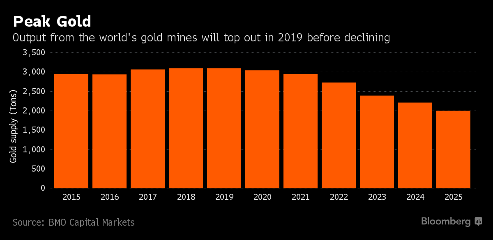

***

### Разведка новых месторождений

* Объем разведанного золота упал на 85% за последние 10 лет

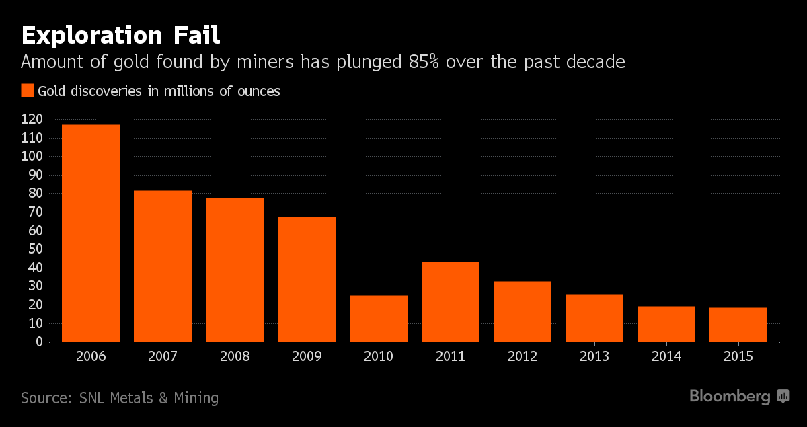

***

### Разведанные запасы

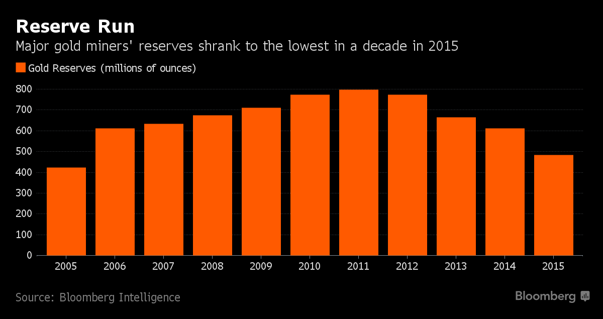

***

### Пополнение разведанных запасов

* Менеджмент вынужден заниматься сделками слияния и поглощения для компенсации снижающихся резервов

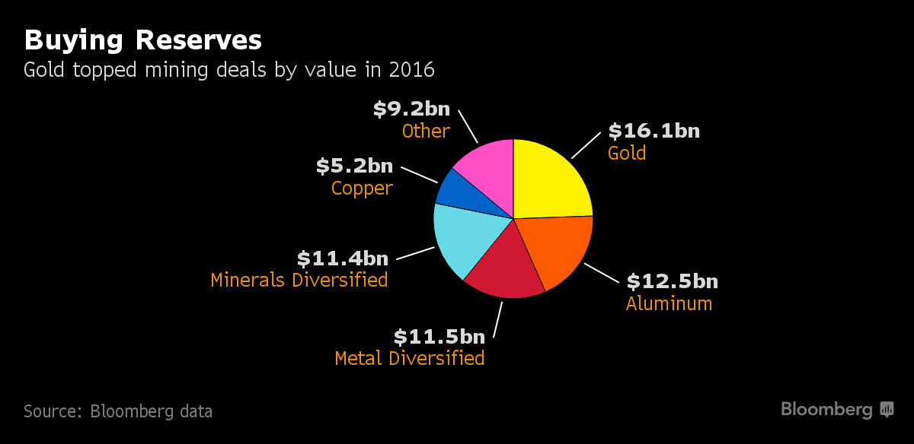

***

### Разведка новых месторождений становится все более дорогостоящей в то время как компании снижают затраты на разработку

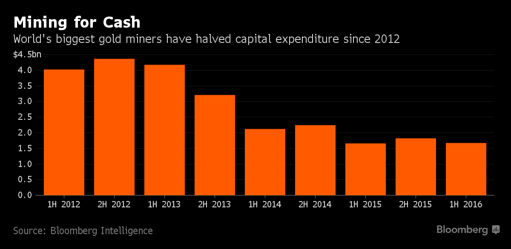

***

### Поставки золота в Шанхае

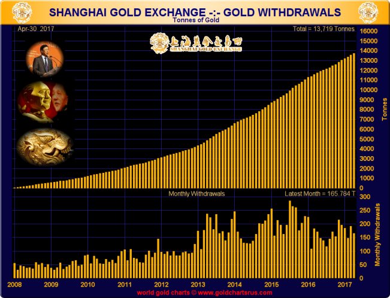

***

### Спрос на золото в Китае и Индии превышает мировую добычу

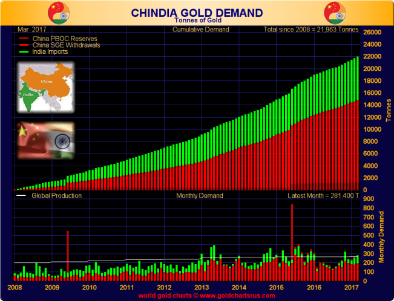

***

### Динамика объема инвестиций в биржевые фонды и цены на золото

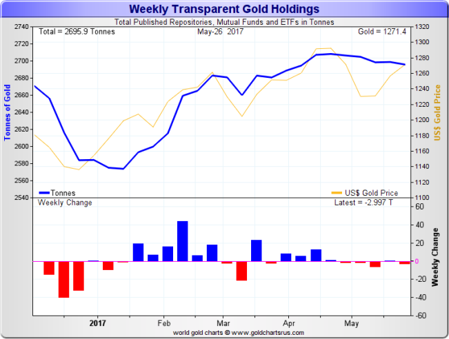

***

### Наиболее прозрачные данные по импорту золота

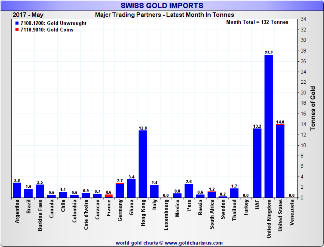

---

### и экспорта

***

### Запасы золота на крупнейшей торговой площадке

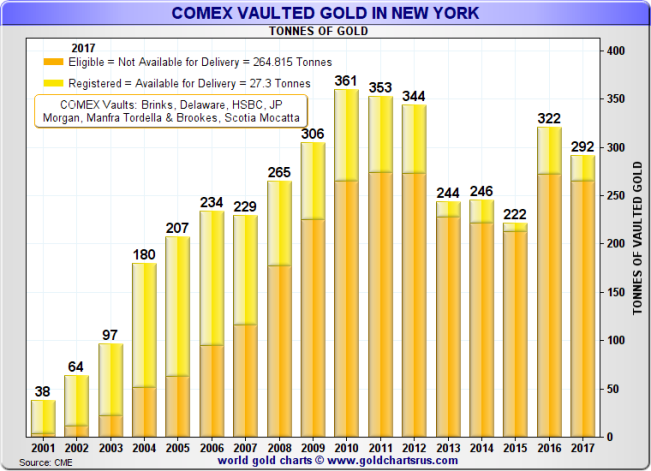

***

### Дефицит и уникальность золота

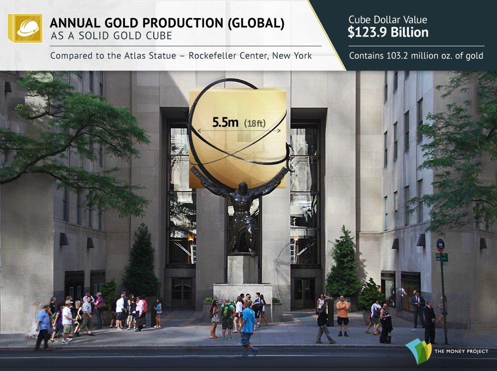

---

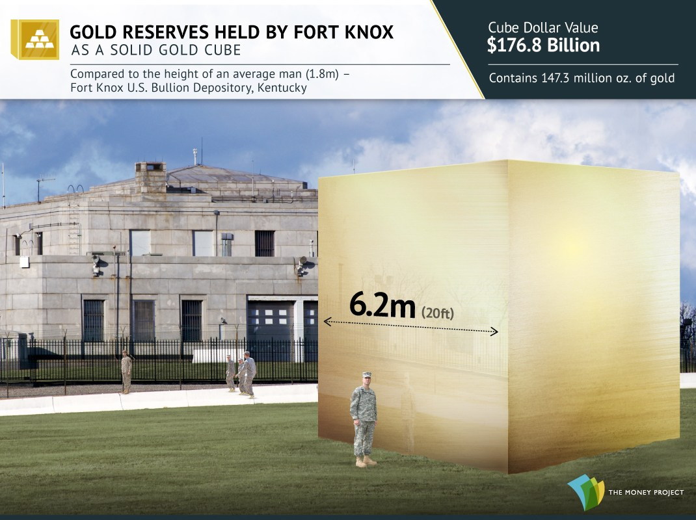

---

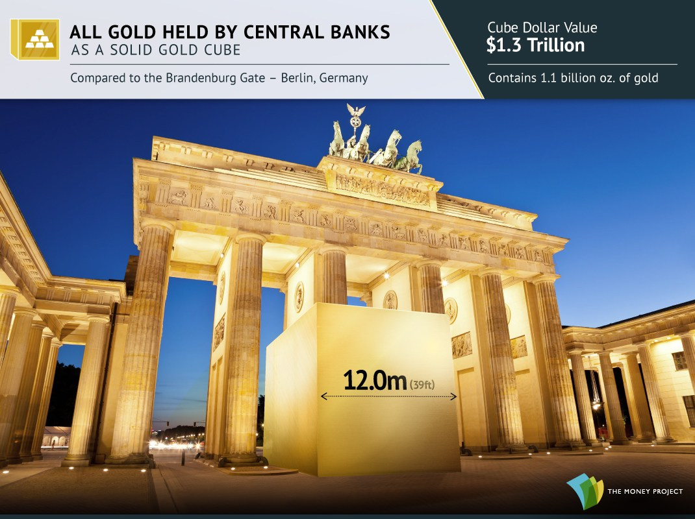

---

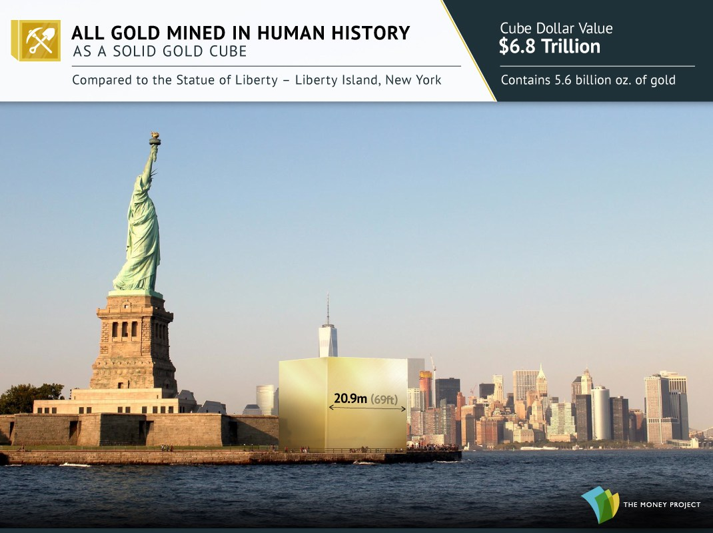

---

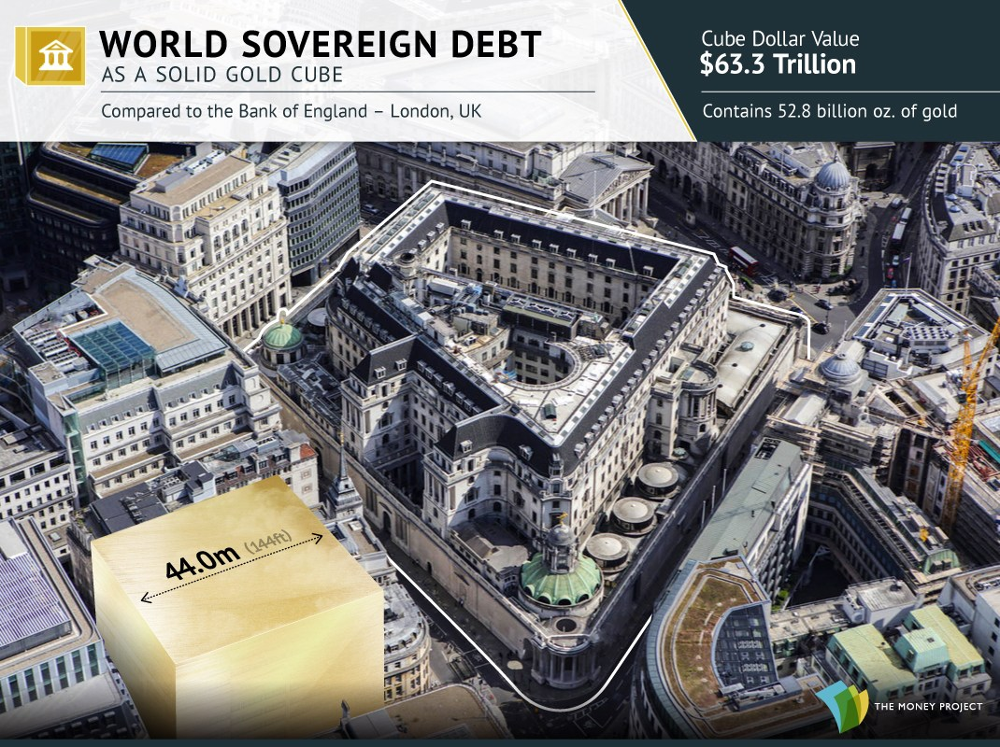

---

***

### Альтернативы золоту

***

### Долговой рынок?

Рост предложения

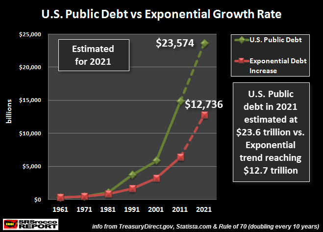

---

### На значительном временном интервале золото доказало 5000 летней историей свойство сохранять покупательную способность

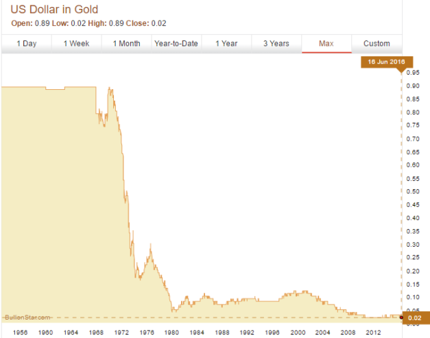

***

### Рынок акций?

* переоцененный
* перекупленный
* эйфорийный нстрой инвесторов

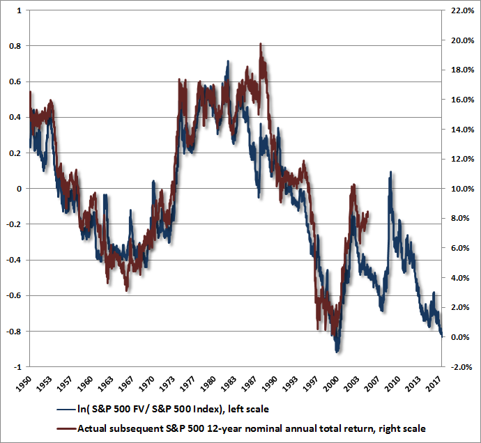

---

### По множеству показателей выше справедливой оценки более чем на 150%

***

### Недвижимость?

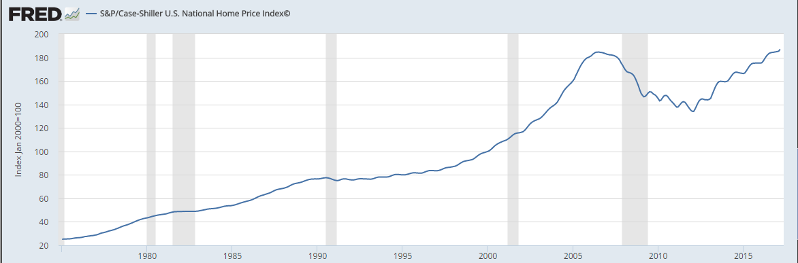

---

### Стоимость к годовому доходу

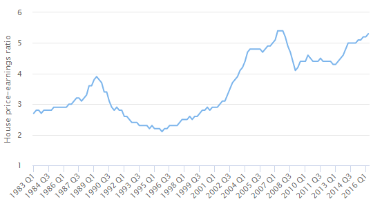

***

### Спасибо за внимание!

