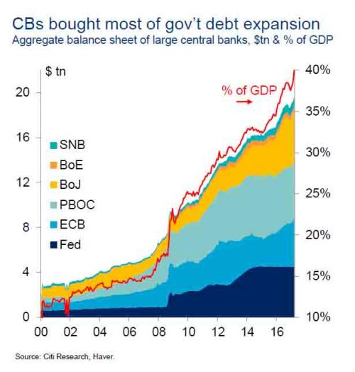
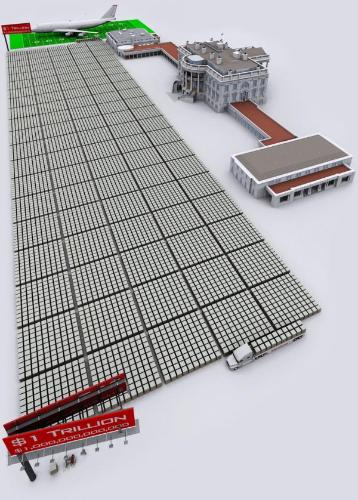
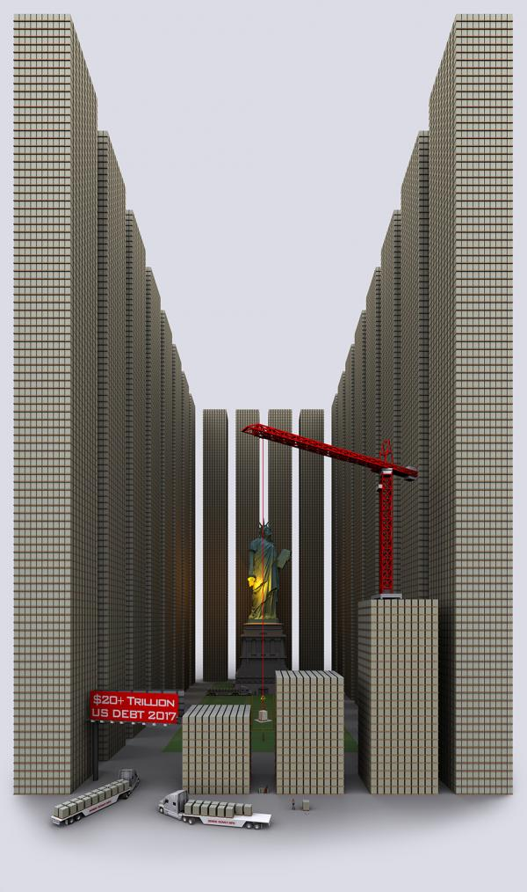
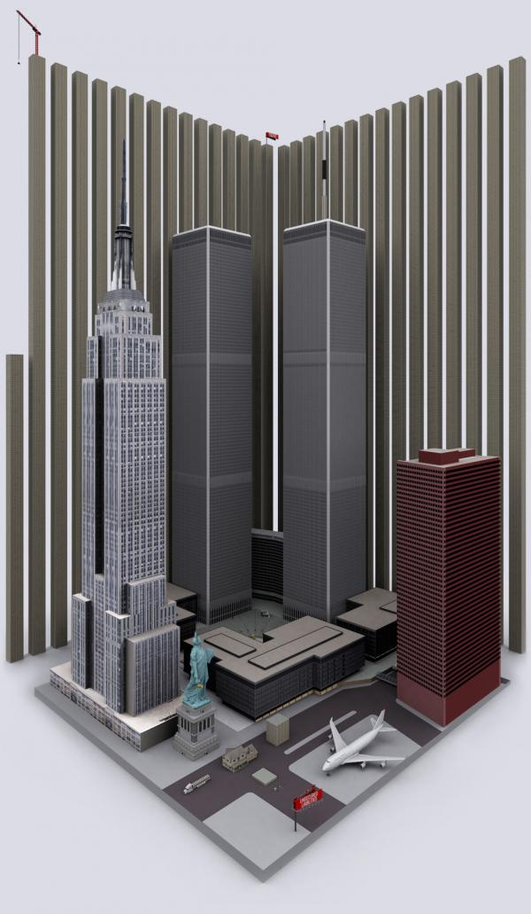

- title : Инвестиции в золото
- title : Инвестиции в золото
- description : Презентация клиентам Сбербанк Private Bank по рыгку золота
- author : Alexey Zorchenkov
- theme : night
- transition : default

### Почему золото и почему сейчас? 
### Почему золото и почему сейчас?

* Отсутствие открытия новых месторождений, постоянный рост стоимости добычи, более 50% всех золотодобывающих компаний имеют даже при отсутствии капиталовложений на разработку новых месторождений стоимость добычи более 1200 долл. за унцию
* Бесконтрольный рост денежной массы со стороны ЦБ Америки, Европы, Японии, Швейцарии и Англии, дефицита бюджета (пенсионные и др. обязательства), торгового баланса в ведущих экономиках, рост систематического риска на финансовых рынках
* Значительный инвестиционный спрос со стороны розничных клиентов: монеты, слитки, биржевые фонды, в последний квартал особо отметим спрос со стороны Европы. Значительные покупки золота на открытом и внутренних рынках со стороны ЦБ Китая, России и пр.

***

### Мировая добыча золота

* Пик добычи придется на 2019 год и далее будет снижаться

***

### Разведка новых месторождений

* Объем разведанного золота упал на 85% за последние 10 лет

***

### Разведанные запасы

***

### Пополнение разведанных запасов

* Менеджмент вынужден заниматься сделками слияния и поглощения для компенсации снижающихся резервов

***

### Разведка новых месторождений становится все более дорогостоящей в то время как компании снижают затраты на разработку

***

### Поставки золота в Шанхае

***

### Спрос на золото в Китае и Индии превышает мировую добычу

***

### Динамика объема инвестиций в биржевые фонды и цены на золото

***

### Наиболее прозрачные данные по импорту золота

---

### и экспорта

***

### Запасы золота на крупнейшей торговой площадке

***

### Дефицит и уникальность золота

---

---

---

---

---

---

***

### Альтернативы золоту

***

### Долговой рынок?

Рост предложения

---

### Снижение стоимости

---

### Создание нового пузыря

---

### Один миллиард долларов

---

### Один триллион долларов

---

### Снижение стоимости

---

### Государственный долг США - двадцать триллионов долларов

---

### Обязательства США - сто двадцать триллионов долларов

***

### Рынок акций?

* переоцененный
* перекупленный
* эйфорийный настрой инвесторов

---

### По множеству показателей выше справедливой оценки более чем на 150%

***

### Недвижимость?

---

### Индикативная стоимость жилой недвижимости к совокупному годовому доходу до налогов
### Создание нового пузыря

---

### Один миллиард долларов

---

### Один триллион долларов

---

### Государственный долг США - двадцать триллионов долларов

---

### Обязательства США - сто двадцать триллионов долларов

***

### Рынок акций?

* переоцененный
* перекупленный
* эйфорийный настрой инвесторов

---

### По множеству показателей выше справедливой оценки более чем на 150%

***

### Инвестиционные инструменты

* Сегрегированное золото:
  * Золотые монеты, украшения
  * Золотые мерные слитки

* Обезличенное золото:
  * Биржевые фонды
  * Металлические счета
  * Золотые сертификаты

* Суррогаты:
  * Акции золотодобывающих компаний
  * Биржевые / внебиржевые Фьючерсы, опционы, CFD на золото

***

### Недвижимость?

---

### Индикативная стоимость жилой недвижимости к совокупному годовому доходу до налогов

***

### Инвестиционные инструменты

* Сегрегированное золото:
  * Золотые монеты, украшения
  * Золотые мерные слитки

* Обезличенное золото:
  * Биржевые фонды
  * Металлические счета
  * Золотые сертификаты

* Суррогаты:
  * Акции золотодобывающих компаний
  * Биржевые / внебиржевые Фьючерсы, опционы, CFD на золото

***

