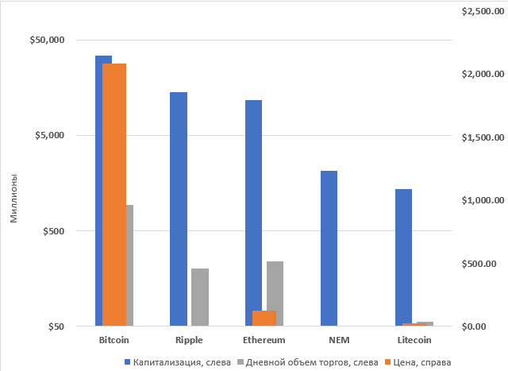
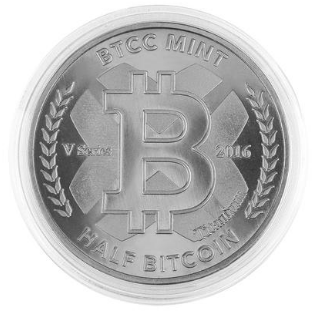
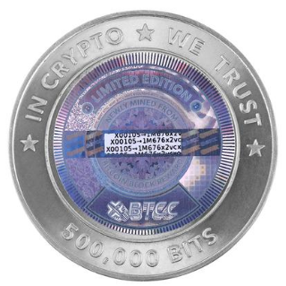
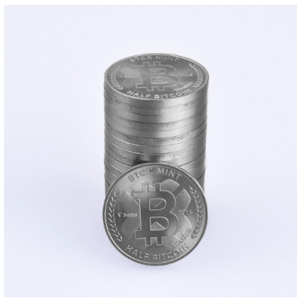

- title : Инвестиции в Bitcoin
- description : Услуги Сбербанк Private Bank на рынке Bitcoin
- author : Alexey Zorchenkov
- theme : night
- transition : default

### Bitcoin 

###### Биткойны существуют только в виде записей в распределённой базе (Blockchain), в которой в общедоступном открытом (нешифрованном) виде хранятся все транзакции, с указанием биткойн-адресов отправителей/получателей, но без информации о реальном владельце этих адресов. В базе нет отдельных записей о текущем количестве биткойнов у какого-либо владельца. Лишь на основании цепочек транзакций становится понятным текущее количество биткойнов, связанных с тем или иным биткойн-адресом. То есть можно увидеть, что на адрес поступил 1 биткойн, а по другой транзакции на этот же адрес поступило 2 биткойна, третья транзакция отправила с этого адреса 1 биткойн. Но в базе не хранится отдельной записи, сколько всего сейчас биткойнов числится за данным адресом — просто предоставляется возможность в любой момент это легко подсчитать. Такие подсчёты автоматически делают клиентские программы, пользователь может и не замечать раздробленности информации.

---

### Ключи

* Пара ключей и биткойн-адрес на бумаге, подготовлены сервисом bitaddress.org. Каждый пользователь системы может генерировать неограниченное количество пар ключей (алгоритм ECDSA с параметром secp256k1). Размер закрытого ключа — 256 бит, а соответствующего ему открытого ключа — 512 бит.

* Основное использование ключей — создание биткойн-адреса и подтверждение правомочности формирования транзакций.

* Создание новой пары ключей автономно и не требует соединения с сетью или Интернетом.

* Хранить ключи можно на любом носителе, не только на карте памяти, но и в бумажном виде. Существуют онлайн кошельки, например, Blockchain.info, Circle Snapcard или Coinbase, которые достаточно просты в использовании. Но проблемы с сайтом такого сервиса могут приводить к потерям.

---

### Адресация

* Адреса создаются при помощи генерации асимметричной пары криптографических ключей. Можно иметь неограниченное число адресов, создавая их по своему желанию. Каждому возможному адресу соответствует баланс, выраженный в биткойнах. Все адреса с ненулевым балансом записаны в децентрализованную цепочку блоков транзакций, защищённую от изменений. При создании адреса, его баланс всегда нулевой и может быть пополнен либо отправкой биткойнов с других адресов, либо путём создания новых биткойнов и комиссионных сборов за счёт майнинга.

* Если секретный ключ утерян, биткойн-сеть не примет никаких других доказательств права собственности. Создать для существующего адреса новый ключ не получится, так как уникальной паре ключей всегда соответствует свой адрес. Биткойны, связанные с адресом, для которого нет закрытого ключа, становятся недоступными, фактически утрачиваются.

---

### Конфиденциальность

Сравнение традиционной модели приватности с моделью приватности в системе Биткойн. Традиционная модель достигает секретности путём ограничения доступа к информации. О сделке могут знать только две стороны и банк. В системе «Биткойн» все транзакции публичны, хранятся в открытом нешифрованном виде, а секретность достигается отсутствием персонификации владельцев адресов. Для конфиденциальности рекомендуется создавать отдельные адреса для каждой транзакции. Это осложняет сопоставление адресов с одним владельцем.

---

### Транзакции

###### Упрощённая структура последовательных транзакций с одним входом и одним выходом Биткойны могут быть переданы любому, кто сообщит корректный биткойн-адрес или открытый ключ. Минимальная передаваемая величина 10^(−8) биткойнов. Для передачи биткойнов текущий владелец создаёт новую транзакцию, которая помимо указаний о количестве передаваемых биткойнов содержит подписанный инициатором хеш предыдущей транзакции, по которой биткойны были получены. Предыдущая транзакция становится «входом» текущей транзакции. Также указывается публичный ключ или биткойн-адрес нового получателя («выход»). Транзакция широковещательным запросом по открытым каналам без шифрования отправляется в сеть. Остальные узлы сети, прежде чем принять транзакцию к обработке, проверяют подписи. Правильность подписи свидетельствует, что инициатор действительно является владельцем секретного ключа для адреса «выхода».

###### Транзакции поддерживают произвольное количество «входов» (ссылок на предыдущие транзакции, в том числе в пользу разных адресов) и «выходов» (указания о получателях). Значения со всех «входов» суммируются, и сумма распределяется по «выходам»

---

### Майнинг

Выпуск новых биткойнов децентрализован, не зависит от какого-либо регулирующего органа, объём эмиссии известен заранее. Стандартная порция новых биткойнов прибавляется к сумме комиссий из транзакций, включённых в очередной блок. Итоговую сумму в качестве вознаграждения получает тот, кто добавил очередной блок в базу транзакций.

Общий объём эмиссии биткойнов ограничен, так как является суммой членов убывающей геометрической прогрессии, и не превысит 21 миллион.

***

### Наиболее ликвидные криптовалюты

***

### Монеты Bitcoin

½ Bitcoin

---

½ Bitcoin, 20 монет

---

1 Bitcoin

***

#### Bitcoin Investment Trust

* First publicly quoted* securities solely invested in and deriving value from the price of bitcoin. The BIT enables investors to gain exposure to the price movement of bitcoin through a traditional investment vehicle, without the challenges of buying, storing, and safekeeping bitcoins.

* Publicly quoted on OTCQX® under the Alternative Reporting Standards

* Titled, auditable ownership through a traditional investment vehicle: shares titled in the investors name.
* Publicly quoted: eligible shares of the Bitcoin Investment Trust are quoted on OTCQX® under the symbol: GBTC, making it possible to buy or sell shares continuously through the trading day at prices established by the market.

---

#### Bitcoin Investment Trust (continue)

* Supported by a network of trusted service providers: Davis Polk & Wardwell LLP serves as legal counsel to the Sponsor of the Bitcoin Investment Trust. Financial statements for the Bitcoin Investment Trust are audited annually by Friedman LLP.

* Robust security and storage: The Bitcoin Investment Trust’s assets are stored with Xapo, Inc., as Custodian, in deep cold storage vaults. Bitcoin stored in the Xapo Vaults reside on multisignature addresses, the private keys for which are protected by intense cryptographic, physical and process security.
  
* ISIN    US09173T1088
* Bloomberg   XBTFUND
* Inception Date  9/25/2013
* Annual Fee  2%
* AUM $232.62M‡
* Shares Outstanding  1,868,700
* Bitcoin per Share   0.09306347

***

### Thank you!

